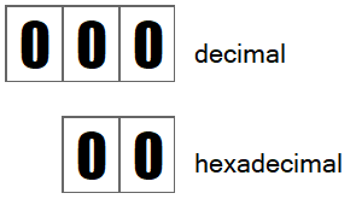
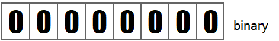

# Intro to Sprites for the Complete Newbie #
For VERA 0.8

You might've heard of the Commander 16 Project where a bunch of people are trying to build a modern retro computer in the style of the Commodore 64 of the 80's. They are porting over some of the C64's components like its BASIC language, while adding new ones like the new VERA video component.

**VERA** stands for **V**ideo **E**nhanced **R**etro **A**dapter, and being "Enhanced" is a good thing because an early 80's video chip is not going to cut it in 2019. Let's take a look look at the sprites functionality of VERA today.

The Commander 16 project is still being worked on, and it's the same thing for VERA. Right now, VERA is at version 0.8, so you know it's close to being complete, but not quite there.

To follow along with this article, you'll need to run the Commander 16 Emulator. For instructions how, see here.

## What is a sprite? ##

A sprite is a piece of graphic that you can move anywhere on the screen, and it can be placed in front of, or behind other graphics, such as a screen of text, or some other backgrounds.

Here's a sprite of a balloon floating across the X16 screen.


## Awesome! Let's do some sprites! ##

If you look at the [VERA Programmer's Reference](https://github.com/commanderx16/x16-docs/blob/master/VERA%20Programmer's%20Reference.md), under the  [Internal Address Space](https://github.com/commanderx16/x16-docs/blob/master/VERA%20Programmer's%20Reference.md#internal-address-space) section, you'll notice that these address ranges have something to do with sprites:

| Address Range   | Description       |
|-----------------|-------------------|
| $F4000 - $F400F | Sprite Registers  |
| $F5000 - $F53FF | Sprite Attributes |

### F-4-thousand Dollars? ###

It's pronounced Hex-F-4-thousand. Just think of these numbers as memory locations that you'll have to put values into to get the sprites system to do stuff. If you're interested in how hexadecimals work, read on, otherwise go to the next section.

### Detour: What is Hexadecimal?

Hexadecimal is another way to write the numbers you've known all these years. Instead of counting with 10 digits, hexadecimal counts with 16 digits.  So, it's 0-1-2-3-4-5-6-7-8-9-A-B-C-D-E-F. It's a bit closer to how computers store data, so programmers like this system.

Before we look into how hexadecimals work, let's look at the good 'ole decimal system that we've known about all this time. Each tick of the number goes through the 10 decimal digits, then the digit to the left increases.


Counting in hexadecimal is the same. You go through all the possible digits (0-F) before you increase the digit to the left.




Let's break down the $F4000 number to see what it's all about:

|Base   |Digit 4|Digit 3|Digit 2|Digit 1|Digit 0|
|:-----:|:-----:|:-----:|:-----:|:-----:|:-----:|
|$      |F      |4      |0      |0      |0      |

The "$" tells you that the number is a hex number -- or base 16. If you have a programmer's calculator on your computer, you can easily find out that $F4000 is the same as 999424. You'll agree that $F4000 is much easier to say than 999424.

Oh, programmers also like to start counting from 0 instead of 1, so it's why you have "Digit 0", instead of "Digit 1". Counting from Digit-0 to Digit-4, gives you 5 digits.


If you're curious about how to do this manually, starting from Digit-0 going to Digit-4, you can use the formula:

0 * (16^0) + 0 * (16^1) + 0 * (16^2) + 4 * (16^3) + 15 * (16^4)

=

0 + 0 + 0 + 4 * 4096 + 15 * 65536

=

999424


Let's get back to sprites. So then, memory locations $F4000 (or 999424) to $F400F (or 999439) contain some controls for the sprites system.

### Sprite Registers ($F4000) ###
<table>
    <thead>
        <tr>
            <th>Register</th>
            <th>Name</th>
            <th>Bit 7</th>
            <th>Bit 6</th>
            <th>Bit 5</th>
            <th>Bit 4</th>
            <th>Bit 3</th>
            <th>Bit 2</th>
            <th>Bit 1</th>
            <th>Bit 0</th>
        </tr>
    </thead>
    <tbod>
        <tr>
            <td>0</td>
            <td>SPR_CTRL</td>
            <td></td>
            <td></td>
            <td></td>
            <td></td>
            <td></td>
            <td></td>
            <td></td>
            <td>EN</td>
        </tr>
        <tr>
            <td>1</td>
            <td>SPR_COLLISION</td>
            <td></td>
            <td></td>
            <td></td>
            <td></td>
            <td colspan="4" align="center">Collision Mask</td>
        </tr>
    </tbody>
</table>

So the first location (Register 0) starting at location $F4000 is called SPR_CTRL, which stands for "Sprite Control." Let's ignore SPR_COLLISION for now. SPR_CTRL has 8 bits within it. With Bit 0 being the Enable (EN) bit. When EN = 1, then the sprites system is turned on. When EN = 0, then it's off.

## Sounds easy! Let's turn on the sprites ##

Now, we need to set the Enable bit of location $F4000 to a 1.
In Commodore BASIC, if you want to put a value into a memory location, you'd use the `POKE` command, as in:

```
POKE 1024, 255
```

This puts the value 255 into memory location 1024. Can you guess how you would turn the Sprite Enabled Bit to a 1?

### POKE $F4000, 1 ? ###

The value of 1 is correct, but it's quite a happy accident -- and we'll get into why a bit later. The memory location $F4000 is is inside VERA and is separate from the Commander 16's main memory. The X16 team now gives us a new command to talk to VERA directly.

`VPOKE`

### So, VPOKE $F4000, 1? ###

Close! The command `VPOKE` makes you split the memory address into 2 parts: 

* The right-most 4 hex digits
* Whatever's leftover on the left side

So, we'd have to use:

`VPOKE $F, $4000, 1`

It's a guess on my part as to why, but I think it's because the C64 is an 8-bit machine, and its CPU can only access memory locations 0 - 65535 ($0 - $FFFF), the original `POKE` wasn't designed to go beyond 65535, and so the new command `VPOKE` is keeping with the old tradition.

Let's enter these command into a program so we can come back to it later. Enter these lines in your X16:

```
100 VPOKE $F, $4000, 1: REM TURN ON SPRITES

RUN
```

### Nothing Happened!!???! ###

I Know. There are 3 more things we need to do before we can make a sprite visible:
1) Determine its size
2) Determine its color format
3) Determine its graphics

### Choose a Sprite's Size ###

A sprite's height and width can be any combination of 8 pixels, 16 pixels, 32 pixels and 64 pixels.

So you can have a 8x64, 64x64, 64x32, etc...

VERA can handle 128 sprites, but we'll only be dealing with 1 for now. A sprite is controlled by its attributes. For the very first sprite, sprite 0, its attributes start in VERA's memory at location $F5000. Let's ignore everything else for now, and just look at the bits that determines the sprite's height and width.

<table>
    <thead>
        <tr>
            <th>Location</th>
            <th>Bit 7</th>
            <th>Bit 6</th>
            <th>Bit 5</th>
            <th>Bit 4</th>
            <th>Bit 3</th>
            <th>Bit 2</th>
            <th>Bit 1</th>
            <th>Bit 0</th>
        </tr>
    </thead>
    <tbody>
        <tr>
            <td>$F5000</td>
            <td colspan="8"></td>
        </tr>
        <tr>
            <td>$F5001</td>
            <td></td>
            <td colspan="3"></td>
            <td colspan="4"></td>
        </tr>
        <tr>
            <td>$F5002</td>
            <td colspan="8"></td>
        </tr>
        <tr>
            <td>$F5003</td>
            <td colspan="6"></td>
            <td colspan="2"></td>
        </tr>
        <tr>
            <td>$F5004</td>
            <td colspan="8"></td>
        </tr>
        <tr>
            <td>$F5005</td>
            <td colspan="6"></td>
            <td colspan="2"></td>
        </tr>
        <tr>
            <td>$F5006</td>
            <td colspan="4"></td>
            <td colspan="2"></td>
            <td></td>
            <td></td>
        </tr>
        <tr>
            <td>$F5007</td>
            <td colspan="2"><b>Sprite height</b></td>
            <td colspan="2"><b>Sprite width</b></td>
            <td colspan="4"></td>
        </tr>
    </tbody>
</table>

`#FF0000` Zooming in on just location $F5000, we can see that Bit-7 & Bit-6 control the sprite's height, and Bit-5 & Bit-4 control the sprite's width.

<table>
    <thead>
        <tr>
            <th>Location</th>
            <th>Bit 7</th>
            <th>Bit 6</th>
            <th>Bit 5</th>
            <th>Bit 4</th>
            <th>Bit 3</th>
            <th>Bit 2</th>
            <th>Bit 1</th>
            <th>Bit 0</th>
        </tr>
    </thead>
    <tbody>
        <tr>
            <td>$F5007</td>
            <td></td>
            <td></td>
            <td></td>
            <td></td>
            <td colspan="4"></td>
        </tr>
        <tr>
            <td></td>
            <td colspan="2" style="background-color:lightyellow">Sprite height</td>
            <td colspan="2" style="background-color:lightyellow">Sprite width</td>
            <td colspan="4"></td>
        </tr>
    </tbody>
</table>

The values you put into those bits are listed below:

| Description | Size Value | Size Bits |
|-------------|:----------:|:---------:|
| 8 pixels    |     0      | 00        |
| 16 pixels   |     1      | 01        |
| 32 pixels   |     2      | 10        |
| 64 pixels   |     3      | 11        |

So, to make a sprite 64x16, you'd put the size bits into $F5000 like so

<table>
    <thead>
        <tr>
            <th>Location</th>
            <th>Bit 7</th>
            <th>Bit 6</th>
            <th>Bit 5</th>
            <th>Bit 4</th>
            <th>Bit 3</th>
            <th>Bit 2</th>
            <th>Bit 1</th>
            <th>Bit 0</th>
        </tr>
    </thead>
    <tbody>
        <tr>
            <td>$F5007</td>
            <td style="text-align:center">1</td>
            <td style="text-align:center">1</td>
            <td style="text-align:center">0</td>
            <td style="text-align:center">1</td>
            <td colspan="4"></td>
        </tr>
        <tr>
            <td></td>
            <td colspan="2" style="background-color:lightyellow">Sprite height</td>
            <td colspan="2" style="background-color:lightyellow">Sprite width</td>
            <td colspan="4"></td>
        </tr>
    </tbody>
</table>

To make a sprite 32x32, you'd put "10" into both of those fields

<table>
    <thead>
        <tr>
            <th>Location</th>
            <th>Bit 7</th>
            <th>Bit 6</th>
            <th>Bit 5</th>
            <th>Bit 4</th>
            <th>Bit 3</th>
            <th>Bit 2</th>
            <th>Bit 1</th>
            <th>Bit 0</th>
        </tr>
    </thead>
    <tbody>
        <tr>
            <td>$F5007</td>
            <td style="text-align:center">1</td>
            <td style="text-align:center">0</td>
            <td style="text-align:center">1</td>
            <td style="text-align:center">0</td>
            <td colspan="4"></td>
        </tr>
        <tr>
            <td></td>
            <td colspan="2" style="background-color:lightyellow">Sprite height</td>
            <td colspan="2" style="background-color:lightyellow">Sprite width</td>
            <td colspan="4"></td>
        </tr>
    </tbody>
</table>

Let's look at how we'll do this with BASIC.

The 0's and 1's of those bits you see above are what's known as the binary system. It's just another counting system like decimals, and hexadecimals, except the digits in binary only goes from 0 to 1. 

Luckily, the team have added support for binary in X16 BASIC, so to get those size bits into $F5007. Just prefix the number with the "%" sign. We'll add last line to our BASIC program like so:

```
100 VPOKE $F, $4000, 1: REM TURN ON SPRITES
110 VPOKE $F, $5007, %10100000: REM MAKE SIZE 32X32

RUN
```

### Still Nothing Happened!!!???!

I know! Remember that I said there are 2 more things you need to do to even make a sprite appear?

Notice that that we have to supply the entire 8 bits to the VPOKE command. Bits 0 through 3 are called the Palette Offset and controls the sprite's colors, but we can ignore them for now.

### Detour: A Quickie on Binary ###

A binary counter is really cool to look at because the digits change so quickly. So here's one that counts from 0 to 32.




### Setting A Sprite's Color Format ###

<table>
    <thead>
        <tr>
            <th>Location</th>
            <th>Bit 7</th>
            <th>Bit 6</th>
            <th>Bit 5</th>
            <th>Bit 4</th>
            <th>Bit 3</th>
            <th>Bit 2</th>
            <th>Bit 1</th>
            <th>Bit 0</th>
        </tr>
    </thead>
    <tbody>
        <tr>
            <td>$F5000</td>
            <td colspan="8"></td>
        </tr>
        <tr>
            <td>$F5001</td>
            <td><b>Mode</b></td>
            <td colspan="3"></td>
            <td colspan="4"></td>
        </tr>
        <tr>
            <td>$F5002</td>
            <td colspan="8"></td>
        </tr>
        <tr>
            <td>$F5003</td>
            <td colspan="6"></td>
            <td colspan="2"></td>
        </tr>
        <tr>
            <td>$F5004</td>
            <td colspan="8"></td>
        </tr>
        <tr>
            <td>$F5005</td>
            <td colspan="6"></td>
            <td colspan="2"></td>
        </tr>
        <tr>
            <td>$F5006</td>
            <td colspan="4"></td>
            <td colspan="2"></td>
            <td></td>
            <td></td>
        </tr>
        <tr>
            <td>$F5007</td>
            <td colspan="2"><b>Sprite height</b></td>
            <td colspan="2"><b>Sprite width</b></td>
            <td colspan="4"></td>
        </tr>
    </tbody>
</table>

Bit-7 of $F5001 is where you'd set a sprite format.

If Bit-7 is a 0, then your sprite can only have a total of 16 colors in its graphics.

If Bit-7 is a 1, then you can use the entire 256 colors palette in your sprite.

Why would someone choose to only use 16 colors? It's memory usage. A 16-colors mode sprite takes up half the memory. So if your program is a memory hog, you might choose to that mode instead.

Let's make our sprite the 256-colors mode, memory management is a bit simpler in that mode. So, to add to our program:

```
100 VPOKE $F, $4000, 1: REM TURN ON SPRITES
110 VPOKE $F, $5007, %10100000: REM MAKE SIZE 32X32
120 VPOKE $F, $5001, %10000000: REM MAKE SPRITE 256-COLORS MODE

RUN
```

### RUN Won't Show Anything ###

There's 1 last thing to do:

* Define the sprite's graphics


<table>
    <thead>
        <tr>
            <th>Location</th>
            <th>Bit 7</th>
            <th>Bit 6</th>
            <th>Bit 5</th>
            <th>Bit 4</th>
            <th>Bit 3</th>
            <th>Bit 2</th>
            <th>Bit 1</th>
            <th>Bit 0</th>
        </tr>
    </thead>
    <tbody>
        <tr>
            <td>$F5000</td>
            <td colspan="8" align="center"><b>Address Bits 5-12</b></td>
        </tr>
        <tr>
            <td>$F5001</td>
            <td><b>Mode</b></td>
            <td colspan="3"></td>
            <td colspan="4"><b>Address Bits 13-16</b></td>
        </tr>
    </tbody>
</table>


TABLE THIS

-- the maximum you can use -- into location 1024. Why is 255 the maximum value?

Each memory location is backed by a "byte" -- which has 8 "bits" in it. You'll recognize now that there are also 8 bits in SPR_CTRL / $F4000.
Each bit can have a value of either 0 or 1 only. This is the binary system, so let me list all the possible values a byte can have:

|Binary   | Decimal |
|--------:|--------:|
|00000000 | 0       |
|00000001 | 1       |
|00000010 | 2       |
|00000011 | 3       |
|00000100 | 4       |
|00000101 | 5       |
|00000110 | 6       |
|00000111 | 7       |
|00001000 | 8       |
|00001001 | 9       |
|00001010 | 10      |

Just kidding, I'm not goint to list out all 256 values a byte can have, but if you need to do the conversion, whip out your programmer's calculator, or use this formula:

<span>Digit<sub>7</sub> * 2^7 + Digit<sub>6</sub> * 2^6 + Digit<sub>5</sub> * 2^5 + Digit<sub>4</sub> * 2^4 + Digit<sub>3</sub> * 2^3 + Digit<sub>2</sub> * 2^2 + Digit<sub>1</sub> * 2^1 + Digit<sub>0</sub> * 2^0</span>

So, going back to the definition for SPR_CTRL

|Name    |Digit 7|Digit 6|Digit 5|Digit 4|Digit 3|Digit 2|Digit 1|Digit 0|
|--------|-------|-------|-------|-------|-------|-------|-------|:-----:|
|SPR_CTRL|       |       |       |       |       |       |       |EN     |

And so, to make the EN bit of SPR_CTRL into a 1, we need to put these binary digits

`00000001` into location `$F4000`

The X16's BASIC also understands binary, as it understands hexadecimal, and you denote a binary number like so:

`%00000001`

And so, the number

`%00000001` (binary) is the same as `$01` (hexadecimal) is the same as `1` (decimal).

PHEW! And you thought counting to 1 was easy.

### So, POKE $F4000, 1? ##


Note the new BASIC takes hexadecimal numbers, but you can use normal decimal numbers as well:

`VPOKE 15, 16384, 1`

But you have to agree that the hex numbers are way easier to remember.
