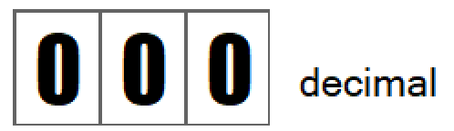

# Intro to Sprites for the Complete Newbie #
For VERA 0.8

You might've heard of the Commander 16 Project where a bunch of people are trying to build a modern retro computer in the style of the Commodore 64 of the 80's. They are porting over some of the C64's components like its BASIC language, while adding new ones like the new VERA video component.

**VERA** stands for **V**ideo **E**nhanced **R**etro **A**dapter, and being "Enhanced" is a good thing because an early 80's video chip is not going to cut it in 2019. Let's take a look look at the sprites functionality of VERA today.

The Commander 16 project is still being worked on, and it's the same thing for VERA. Right now, VERA is at version 0.8, so you know it's close to being complete, but not quite there.

To follow along with this article, you'll need to run the Commander 16 Emulator. For instructions how, see here.

## What is a sprite? ##

A sprite is a piece of graphic that you can move anywhere on the screen, and it can be placed in front of, or behind other graphics, such as a screen of text, or some other backgrounds.

Here's a sprite of a balloon floating across the X16 screen.


## Awesome! Let's do some sprites! ##

If you look at the [VERA Programmer's Reference](https://github.com/commanderx16/x16-docs/blob/master/VERA%20Programmer's%20Reference.md), under the  [Internal Address Space](https://github.com/commanderx16/x16-docs/blob/master/VERA%20Programmer's%20Reference.md#internal-address-space) section, you'll notice that these address ranges have something to do with sprites:

| Address Range   | Description       |
|-----------------|-------------------|
| $F4000 - $F400F | Sprite Registers  |
| $F5000 - $F53FF | Sprite Attributes |

### F-4-thousand Dollars? ###

It's actually pronounced Hex-F-4-thousand. Hexadecimal is another way to write the numbers you've known all these years. Instead of counting with 10 digits, hexadecimal counts with 16 digits.  So, it's 0-1-2-3-4-5-6-7-8-9-A-B-C-D-E-F. It's a bit closer to how computers store data, so programmers like this system.

Before we look into how hexadecimals work, let's look at the good 'ole decimal system that we've known about all this time:



Let's break down $F4000 to see what it's all about:

|Base   |Digit 4|Digit 3|Digit 2|Digit 1|Digit 0|
|:-----:|:-----:|:-----:|:-----:|:-----:|:-----:|
|$      |F      |4      |0      |0      |0      |

The "$" tells you that the number is a hex number -- or base 16. If you have a programmer's calculator on your computer, you can easily find out that $F4000 is the same as 999424. You'll agree that $F4000 is easier to say than 999424.

Oh, programmers also like to start counting from 0 instead of 1, so it's why you have "Digit 0", instead of "Digit 1". Counting from digit-0 to digit-4, gives you 5 digits.


If you're curious about how to do this manually, starting from digit-0 going to digit-4, you can use the formula:

0 * (16^0) + 0 * (16^1) + 0 * (16^2) + 4 * (16^3) + 15 * (16^4)

=

0 + 0 + 0 + 4 * 4096 + 15 * 65536

=

999424


So memory locations $F4000 (or 999424) to $F400F (or 999439) contain some controls for the sprites system.

### Sprite Registers ($F4000) ###
<table>
    <thead>
        <tr>
            <th>Register</th>
            <th>Name</th>
            <th>Bit 7</th>
            <th>Bit 6</th>
            <th>Bit 5</th>
            <th>Bit 4</th>
            <th>Bit 3</th>
            <th>Bit 2</th>
            <th>Bit 1</th>
            <th>Bit 0</th>
        </tr>
    </thead>
    <tbod>
        <tr>
            <td>0</td>
            <td>SPR_CTRL</td>
            <td></td>
            <td></td>
            <td></td>
            <td></td>
            <td></td>
            <td></td>
            <td></td>
            <td>EN</td>
        </tr>
        <tr>
            <td>1</td>
            <td>SPR_COLLISION</td>
            <td></td>
            <td></td>
            <td></td>
            <td></td>
            <td colspan="4" align="center">Collision Mask</td>
        </tr>
    </tbody>
</table>

So the first location (Register 0) starting at location $F4000 is called SPR_CTRL, which stands for "Sprite Control." Let's ignore SPR_COLLISION for now. SPR_CTRL has 8 bits within it. With Bit 0 being the Enable (EN) bit. When EN = 1, then the sprites system is turned on. When EN = 0, then it's off.

## Sounds easy! Let's turn on the sprites ##

In Commodore BASIC, if you want to put a value into a memory location, you'd use the `POKE` command, as in:

```
POKE 1024, 255
```

This puts the value 255 -- the maximum you can use -- into location 1024. Why is 255 the maximum value?

Each memory location is backed by a "byte" -- which has 8 "bits" in it. You'll recognize now that there are also 8 bits in SPR_CTRL / $F4000.
Each bit can have a value of either 0 or 1 only. This is the binary system, so let me list all the possible values a byte can have:

|Binary   | Decimal |
|--------:|--------:|
|00000000 | 0       |
|00000001 | 1       |
|00000010 | 2       |
|00000011 | 3       |
|00000100 | 4       |
|00000101 | 5       |
|00000110 | 6       |
|00000111 | 7       |
|00001000 | 8       |
|00001001 | 9       |
|00001010 | 10      |

Just kidding, I'm not goint to list out all 256 values a byte can have, but if you need to do the conversion, whip out your programmer's calculator, or use this formula:

<span>Digit<sub>7</sub> * 2^7 + Digit<sub>6</sub> * 2^6 + Digit<sub>5</sub> * 2^5 + Digit<sub>4</sub> * 2^4 + Digit<sub>3</sub> * 2^3 + Digit<sub>2</sub> * 2^2 + Digit<sub>1</sub> * 2^1 + Digit<sub>0</sub> * 2^0</span>

So, going back to the definition for SPR_CTRL

|Name    |Digit 7|Digit 6|Digit 5|Digit 4|Digit 3|Digit 2|Digit 1|Digit 0|
|--------|-------|-------|-------|-------|-------|-------|-------|:-----:|
|SPR_CTRL|       |       |       |       |       |       |       |EN     |

And so, to make the EN bit of SPR_CTRL into a 1, we need to put these binary digits

`00000001` into location `$F4000`

The X16's BASIC also understands binary, as it understands hexadecimal, and you denote a binary number like so:

`%00000001`

And so, the number

`%00000001` (binary) is the same as `$01` (hexadecimal) is the same as `1` (decimal).

PHEW! And you thought counting to 1 was easy.

### So, POKE $F4000, 1? ##

Not quite! $F4000 is the VERA adapter's memory and is separate from the Commander 16's main memory. `POKE` is used to access main memory, not video memory. Luckily, the team has given us a new command:

`VPOKE`

### So, VPOKE $F4000, 1? ###

Almost! but still no! Because the C64 was an 8-bit machine, and its CPU can only access memory locations 0 - 65535 ($0 - $FFFF), the original `POKE` wasn't designed to go beyond 65535, and so the new command `VPOKE` is keeping with the old tradition. Instead, `VPOKE` makes you split the memory address into 2 parts: 

* The right-most 4 hex digits
* Whatever's leftover on the left side

So, we'd have to use:

`VPOKE $F, $4000, 1`

Note the new BASIC takes hexadecimal numbers, but you can use normal decimal numbers as well:

`VPOKE 15, 16384, 1`

But you have to agree that the hex numbers are way easier to remember.

### I Just `VPOKE $F, $4000, 1` and Nothing Happened ###

